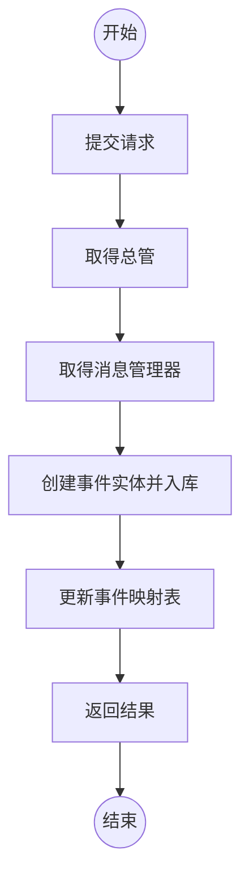

<!--
Author: 闫刚 (yes7rose@sina.com)
事件创建过程.md (c) 2020
Desc: 事件创建过程
Created:  2020-12-02T12:55:35.008Z
Modified: !date!
-->

# 事件创建过程

```mermaid
graph TD
    开始((开始))-->提交请求-->取得总管-->取得消息管理器-->创建事件实体并入库-->更新事件映射表-->返回结果-->结束((结束))
```