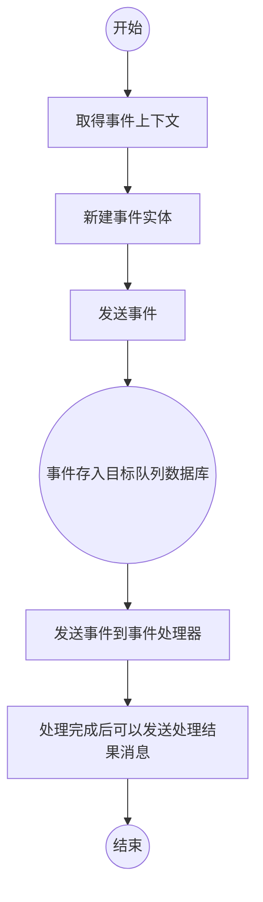

<!--
Author: 闫刚 (yes7rose@sina.com)
事件触发和处理过程.md (c) 2020
Desc: 事件触发和相应处理过程
Created:  2020-12-02T12:59:18.421Z
Modified: !date!
-->

# 事件触发和相应处理过程

```mermaid
graph TD
    开始((开始))-->取得事件上下文-->新建事件实体-->发送事件-->事件存入目标队列数据库((事件存入目标队列数据库))-->发送事件到事件处理器-->处理完成后可以发送处理结果消息-->结束((结束))
```